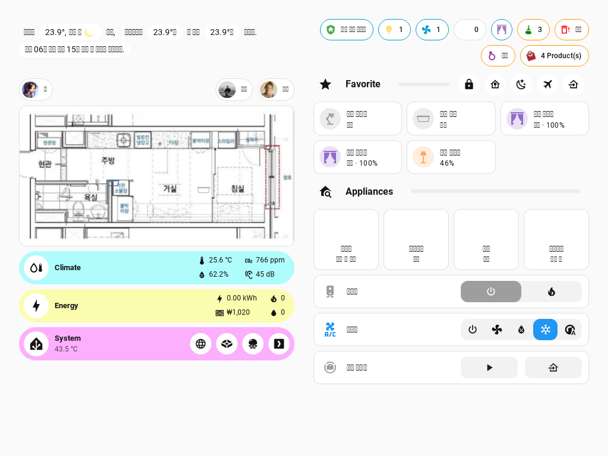
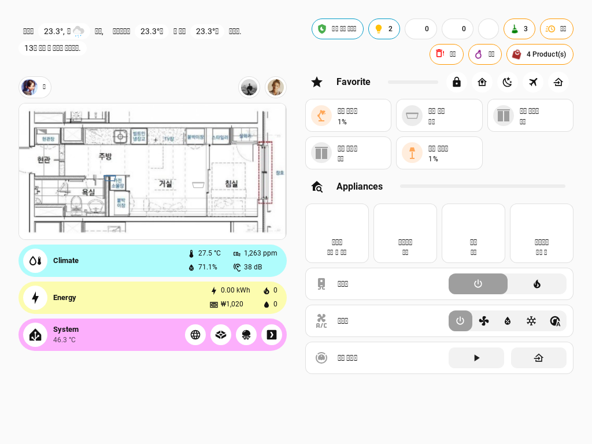

# Home Assistant Config

![Project Maintenance][maintenance-shield]
[![GitHub Workflow Status][github-img]][github-url]
[![Last Commit][last-commit-img]][github-url]
[![Commit Activity][commit-activity-img]][github-url]
[![License][license-img]][license-url]
[![GitHub Stars][stars-img]][github-url]

This is my Home Assistant configuration, updated on 2025-08-15.

I started using Home Assistant in 2018. Now, it has grown significantly, with a total of 1535 entities for now.

> [!CAUTION]
> I constantly improve my home. It evolves as I add new devices and services. It's changing as my daily routines are changing.
> Please, keep in mind **this documentation might be outdated** in covering some details. However, I'll try my best to keep this updated.

This repository publish it's documentation. Go to: [Documentation][docs-url]

Or you can directly go to:

[Hardware](./docs/hardware.md) |
[Configuration](./docs/config/index.md) |
[Retired](./docs/retired.md) |
[Inspiration](./docs/resources.md)

## Table of Content

[Insights](#insights) |
[Integrations](#integrations) |
[Automations](#automations) |
[Add-Ons](#add-ons) |
[Dashboards](#dashboards) |
[Custom Integrations](#custom-integrations) |

---

## Insights

| Domain          | Value    |
| --------------- | -------- |
| automations     | 30       |
| binary_sensors  | 153      |
| device_trackers | 14       |
| lights          | 18       |
| media_players   | 9        |
| sensors         | 831      |
| switches        | 148      |
| switches        | 148      |
| others          | 332      |
| **Total**       | **1535** |

## Integrations

| Integration                                                                                                                                                                                                                                                                                                                                                                                                              | Name                                                                                                          |
| ------------------------------------------------------------------------------------------------------------------------------------------------------------------------------------------------------------------------------------------------------------------------------------------------------------------------------------------------------------------------------------------------------------------------ | ------------------------------------------------------------------------------------------------------------- |
|                                                                              | [17TRACK](https://home-assistant.io/integrations/seventeentrack)                                              |
|                                                                                                                  | [alert](https://home-assistant.io/integrations/alert)                                                         |
|                                                                                                  | [Anthropic Conversation](https://home-assistant.io/integrations/anthropic)                                    |
|                                                                                                              | [Apple iCloud](https://home-assistant.io/integrations/icloud)                                                 |
|                                                                                                      | [Apple TV](https://home-assistant.io/integrations/apple_tv)                                                   |
|                                                                                              | [Automation](https://home-assistant.io/integrations/automation)                                               |
|                                                                                                              | [Backup](https://home-assistant.io/integrations/backup)                                                       |
|                                                                                                  | [Bluetooth](https://home-assistant.io/integrations/bluetooth)                                                 |
|                                                                                                              | [CalDAV](https://home-assistant.io/integrations/caldav)                                                       |
|                                                                                                      | [Calendar](https://home-assistant.io/integrations/calendar)                                                   |
|                                                                                          | [Certificate Expiry](https://home-assistant.io/integrations/cert_expiry)                                      |
|                                                                                      | [Command Line](https://home-assistant.io/integrations/command_line)                                           |
|                                                                              | [Default Config](https://home-assistant.io/integrations/default_config)                                       |
|                                                                                                          | [Discord](https://home-assistant.io/integrations/discord)                                                     |
|                                                                                              | [Downloader](https://home-assistant.io/integrations/downloader)                                               |
|                                                                                                  | [Electricity Maps](https://home-assistant.io/integrations/co2signal)                                          |
|                                                                                                          | [ESPHome](https://home-assistant.io/integrations/esphome)                                                     |
|                                                                                              | [Feedreader](https://home-assistant.io/integrations/feedreader)                                               |
|                                                                                                      | [Frontend](https://home-assistant.io/integrations/frontend)                                                   |
|                                                                                          | [Fully Kiosk Browser](https://home-assistant.io/integrations/fully_kiosk)                                     |
|                                                                                                          | [Generic Camera](https://home-assistant.io/integrations/generic)                                              |
|                                                                                                              | [GitHub](https://home-assistant.io/integrations/github)                                                       |
|                                                                                      | [Google Drive](https://home-assistant.io/integrations/google_drive)                                           |
|  | [Google Generative AI Conversation](https://home-assistant.io/integrations/google_generative_ai_conversation) |
|                                                                      | [Google Translate text-to-speech](https://home-assistant.io/integrations/google_translate)                    |
|                                                                                                          | [History](https://home-assistant.io/integrations/history)                                                     |
|                                                                                                          | [Holiday](https://home-assistant.io/integrations/holiday)                                                     |
|                                                                                  | [Home Assistant Core Integration](https://home-assistant.io/integrations/homeassistant)                       |
|                                                                                                                      | [HTTP](https://home-assistant.io/integrations/http)                                                           |
|                                                                                                                      | [IMAP](https://home-assistant.io/integrations/imap)                                                           |
|                                                                                                              | [Last.fm](https://home-assistant.io/integrations/lastfm)                                                      |
|                                                                                                      | [LG ThinQ](https://home-assistant.io/integrations/lg_thinq)                                                   |
|                                                                              | [Local Calendar](https://home-assistant.io/integrations/local_calendar)                                       |
|                                                                                                      | [Local IP Address](https://home-assistant.io/integrations/local_ip)                                           |
|                                                                                              | [Local To Do](https://home-assistant.io/integrations/local_todo)                                              |
|                                                                                                              | [Logger](https://home-assistant.io/integrations/logger)                                                       |
|                                                                                                      | [Lovelace](https://home-assistant.io/integrations/lovelace)                                                   |
|                                                                                                              | [Matter](https://home-assistant.io/integrations/matter)                                                       |
|                                                                          | [Media extractor](https://home-assistant.io/integrations/media_extractor)                                     |
|                                                                                              | [Mobile App](https://home-assistant.io/integrations/mobile_app)                                               |
|                                                                                              | [Model Context Protocol Server](https://home-assistant.io/integrations/mcp_server)                            |
|                                                                                                                      | [Moon](https://home-assistant.io/integrations/moon)                                                           |
|                                                                                                                      | [MQTT](https://home-assistant.io/integrations/mqtt)                                                           |
|                                                                          | [Music Assistant](https://home-assistant.io/integrations/music_assistant)                                     |
|                                                                                                                              | [My Home Assistant](https://home-assistant.io/integrations/my)                                                |
|                                                                                                              | [notify](https://home-assistant.io/integrations/notify)                                                       |
|                                                                                                                      | [Open Thread Border Router](https://home-assistant.io/integrations/otbr)                                      |
|                                                          | [OpenAI Conversation](https://home-assistant.io/integrations/openai_conversation)                             |
|                                                                                                                  | [Oral-B](https://home-assistant.io/integrations/oralb)                                                        |
|                                                                                                                      | [Ping (ICMP)](https://home-assistant.io/integrations/ping)                                                    |
|                                                                                                                      | [Plex Media Server](https://home-assistant.io/integrations/plex)                                              |
|                                                              | [Private BLE Device](https://home-assistant.io/integrations/private_ble_device)                               |
|                                                                                              | [Prometheus](https://home-assistant.io/integrations/prometheus)                                               |
|                                                                                                  | [Proximity](https://home-assistant.io/integrations/proximity)                                                 |
|                                                                                                  | [Raspberry Pi Power Supply Checker](https://home-assistant.io/integrations/rpi_power)                         |
|                                                                                                      | [Recorder](https://home-assistant.io/integrations/recorder)                                                   |
|                                                                          | [Remote Calendar](https://home-assistant.io/integrations/remote_calendar)                                     |
|                                                                                                                  | [Scene](https://home-assistant.io/integrations/scene)                                                         |
|                                                                                                              | [Scrape](https://home-assistant.io/integrations/scrape)                                                       |
|                                                                                                              | [Script](https://home-assistant.io/integrations/script)                                                       |
|                                                                                                              | [Season](https://home-assistant.io/integrations/season)                                                       |
|                                                                                  | [Shell Command](https://home-assistant.io/integrations/shell_command)                                         |
|                                                                                          | [SmartThings](https://home-assistant.io/integrations/smartthings)                                             |
|                                                                                                                          | [SQL](https://home-assistant.io/integrations/sql)                                                             |
|                                                                                      | [Steam](https://home-assistant.io/integrations/steam_online)                                                  |
|                                                                                                                          | [Sun](https://home-assistant.io/integrations/sun)                                                             |
|                                                                                                              | [Supervisor](https://home-assistant.io/integrations/hassio)                                                   |
|                                                                                  | [System Monitor](https://home-assistant.io/integrations/systemmonitor)                                        |
|                                                                                                      | [Template](https://home-assistant.io/integrations/template)                                                   |
|                      | [Template Alarm control panel](https://home-assistant.io/integrations/alarm_control_panel.template)           |
|                                                                                                              | [Thread](https://home-assistant.io/integrations/thread)                                                       |
|                                                                                                  | [Time & Date](https://home-assistant.io/integrations/time_date)                                               |
|                                                                                                          | [Todoist](https://home-assistant.io/integrations/todoist)                                                     |
|                                                                                                              | [Uptime](https://home-assistant.io/integrations/uptime)                                                       |
|                                                                                                          | [Version](https://home-assistant.io/integrations/version)                                                     |
|                                                                                                      | [Withings](https://home-assistant.io/integrations/withings)                                                   |
|                                                                                                          | [Workday](https://home-assistant.io/integrations/workday)                                                     |
|                                                                                                          | [YouTube](https://home-assistant.io/integrations/youtube)                                                     |
|                                                                                                              | [Zodiac](https://home-assistant.io/integrations/zodiac)                                                       |

## Automations

> [!TIP]
> If you want to see my automation details other than list, go to [Automations](./docs/config/automations.md)

> [!TIP]
> Or if you want to see `automations.yaml`, click [automations.yaml](./automations.yaml)

| Name                                       | Description    |
| ------------------------------------------ | -------------- |
| Apply Away Scene when no person is home    | mode: single   |
| Apply Welcome Scene when Person Enter Zone | mode: single   |
| Bathroom Occupancy Light Control           | mode: restart  |
| ESPHome Auto-Update                        | mode: single   |
| HA Startup                                 | mode: single   |
| iOS Action - Run Vacuum Yes                | mode: single   |
| Kitchen Occupancy Light Control            | mode: restart  |
| Notify LG ThinQ Notifications              | mode: single   |
| Notify Personal Agenda                     | mode: single   |
| Notify Seoul Teukbo                        | mode: single   |
| Notify Steam Wishlist on Sales             | mode: parallel |
| Notify Study Interruption                  | mode: single   |
| Notify to brush Teeth                      | mode: single   |
| Notify Work Agenda                         | mode: single   |
| Play Playlist on Cooking Scene             | mode: single   |
| Play Playlist on Shower Scene              | mode: single   |
| Purge Log Filesize                         | mode: single   |
| Track Floor Cleaning by Robot Vacuum       | mode: single   |
| TTS on door opening with persons at home   | mode: single   |
| TTS 캐시 지우기                            | mode: single   |
| Update Datetime every 10 minutes           | mode: single   |
| Washer State On                            | mode: single   |
| 구청에서 온 알림 처리 및 확인 요청         | mode: parallel |
| 막차 알림                                  | mode: single   |
| 배터리 부족 알림                           | mode: single   |
| 새 이메일 도착 알림                        | mode: queued   |
| 아침 알림 및 시작 준비                     | mode: single   |
| 유튜브 최신 영상 저장 및 알림              | mode: parallel |
| 침대에서 침대에 누워 있다고 알림           | mode: single   |
| 핫 세일 알림 (위시리스트 체크)             | mode: parallel |

## Add-Ons

> [!TIP]
> If you want to see services I'm running as add-ons, go to [Services](./docs/config/services.md)

> [!TIP]
> If you want to see how I built my grafana dashboards, go to [Monitoring](./docs/config/monitoring.md)

| Name                                                                                                                                       | Version       | Description |
| ------------------------------------------------------------------------------------------------------------------------------------------ | ------------- | ----------- |
| [Advanced SSH & Web Terminal](https://my.home-assistant.io/redirect/supervisor_addon/?addon=a0d7b954_ssh)                                  | 21.0.2        | started     |
| [DbStats](https://my.home-assistant.io/redirect/supervisor_addon/?addon=8bce8ef4_dbstats)                                                  | 0.5.12        | started     |
| [ESPHome Device Builder](https://my.home-assistant.io/redirect/supervisor_addon/?addon=5c53de3b_esphome)                                   | 2025.7.5      | started     |
| [File editor](https://my.home-assistant.io/redirect/supervisor_addon/?addon=core_configurator)                                             | 5.8.0         | started     |
| [Firefly iii](https://my.home-assistant.io/redirect/supervisor_addon/?addon=db21ed7f_fireflyiii)                                           | 6.2.21        | started     |
| [Git pull](https://my.home-assistant.io/redirect/supervisor_addon/?addon=core_git_pull)                                                    | 8.0.1         | unknown     |
| [Grafana](https://my.home-assistant.io/redirect/supervisor_addon/?addon=a0d7b954_grafana)                                                  | 11.0.0        | started     |
| [Grocy](https://my.home-assistant.io/redirect/supervisor_addon/?addon=a0d7b954_grocy)                                                      | 0.24.0        | started     |
| [HassOS SSH port 22222 Configurator](https://my.home-assistant.io/redirect/supervisor_addon/?addon=2ad4c73a_hassos_ssh_configurator_addon) | 0.9.3         | stopped     |
| [iSponsorBlockTV add-on](https://my.home-assistant.io/redirect/supervisor_addon/?addon=932a64e5_isponsorblocktv)                           | 2.3.0         | started     |
| [KNXD daemon](https://my.home-assistant.io/redirect/supervisor_addon/?addon=ecaeb50e_knxd)                                                 | 0.6.1         | started     |
| [Let's Encrypt](https://my.home-assistant.io/redirect/supervisor_addon/?addon=core_letsencrypt)                                            | 5.4.9         | stopped     |
| [Mailfilter](https://my.home-assistant.io/redirect/supervisor_addon/?addon=32b8266a_mailfilter)                                            | 4.2.2         | started     |
| [Mailserver](https://my.home-assistant.io/redirect/supervisor_addon/?addon=32b8266a_mailserver)                                            | 4.3.0         | started     |
| [MariaDB](https://my.home-assistant.io/redirect/supervisor_addon/?addon=core_mariadb)                                                      | 2.7.2         | started     |
| [Matter Server](https://my.home-assistant.io/redirect/supervisor_addon/?addon=core_matter_server)                                          | 8.1.0         | started     |
| [MCP Proxy Server](https://my.home-assistant.io/redirect/supervisor_addon/?addon=adfd7a46_mcp_proxy_server)                                | 0.4.1         | started     |
| [Mosquitto broker](https://my.home-assistant.io/redirect/supervisor_addon/?addon=core_mosquitto)                                           | 6.5.1         | started     |
| [MQTT Explorer](https://my.home-assistant.io/redirect/supervisor_addon/?addon=2ad4c73a_mqtt-explorer)                                      | browser-1.0.1 | started     |
| [Music Assistant Server](https://my.home-assistant.io/redirect/supervisor_addon/?addon=d5369777_music_assistant)                           | 2.5.8         | started     |
| [NGINX Home Assistant SSL proxy](https://my.home-assistant.io/redirect/supervisor_addon/?addon=core_nginx_proxy)                           | 3.13.0        | started     |
| [OpenThread Border Router](https://my.home-assistant.io/redirect/supervisor_addon/?addon=core_openthread_border_router)                    | 2.13.0        | started     |
| [Paperless-ngx](https://my.home-assistant.io/redirect/supervisor_addon/?addon=ca5234a0_paperless-ngx)                                      | 3.0.2         | started     |
| [phpMyAdmin](https://my.home-assistant.io/redirect/supervisor_addon/?addon=a0d7b954_phpmyadmin)                                            | 0.12.0        | started     |
| [Pocket ID](https://my.home-assistant.io/redirect/supervisor_addon/?addon=c80c7555_pocket-id)                                              | 1.1.9         | started     |
| [Puppet](https://my.home-assistant.io/redirect/supervisor_addon/?addon=0f1cc410_puppet)                                                    | 1.19.0        | started     |
| [Roundcube](https://my.home-assistant.io/redirect/supervisor_addon/?addon=32b8266a_roundcube)                                              | 1.1.1         | started     |
| [Samba share](https://my.home-assistant.io/redirect/supervisor_addon/?addon=core_samba)                                                    | 12.5.2        | unknown     |
| [Studio Code Server](https://my.home-assistant.io/redirect/supervisor_addon/?addon=a0d7b954_vscode)                                        | 5.19.3        | started     |
| [Tika-Gotenberg](https://my.home-assistant.io/redirect/supervisor_addon/?addon=ca5234a0_tika-gotenberg)                                    | 0.1.0         | started     |
| [VictoriaMetrics](https://my.home-assistant.io/redirect/supervisor_addon/?addon=8f49de54_victoria_metrics)                                 | 1.123.0       | started     |
| [Whisper](https://my.home-assistant.io/redirect/supervisor_addon/?addon=core_whisper)                                                      | 2.6.0         | started     |

## Dashboards

> [!TIP]
> If you want to see how I built my dashboards other than list, go to [Dashboards](./docs/config/dashboards)

<table>
  <tr>
    <td>
       
      Lovelace Dashboard
    </td>
    <td>
       
      Thread Network Visualization
    </td>
  </tr>
  <tr>
    <td>
       
      Monitoring Dashboard
    </td>
    <td>
       
      Energy Dashboard
    </td>
  </tr>
</table>

### Lovelace Plugins

| Name                                                                                                             | Description                                                                                                                                                                                 |
| ---------------------------------------------------------------------------------------------------------------- | ------------------------------------------------------------------------------------------------------------------------------------------------------------------------------------------- |
| [Apexcharts Card](https://github.com/RomRider/apexcharts-card)                                                   | 📈 A Lovelace card to display advanced graphs and charts based on ApexChartsJS for Home Assistant                                                                                           |
| [Auto Entities](https://github.com/thomasloven/lovelace-auto-entities)                                           | 🔹Automatically populate the entities-list of lovelace cards                                                                                                                                |
| [Bha Icon Pack](https://github.com/hulkhaugen/hass-bha-icons)                                                    | Additional icons for Home Assistant to accompany the MDI icons                                                                                                                              |
| [Bubble Card](https://github.com/Clooos/Bubble-Card)                                                             | Bubble Card is a minimalist card collection for Home Assistant with a nice pop-up touch.                                                                                                    |
| [Card Mod](https://github.com/thomasloven/lovelace-card-mod)                                                     | 🔹 Add CSS styles to (almost) any lovelace card                                                                                                                                             |
| [Custom Brand Icons](https://github.com/elax46/custom-brand-icons)                                               | Custom brand icons for Home Assistant                                                                                                                                                       |
| [Energy Entity Row](https://github.com/zeronounours/lovelace-energy-entity-row)                                  | Lovelace HA entity row to integrate with energy-date-selection                                                                                                                              |
| [Energy Flow Card Plus](https://github.com/flixlix/energy-flow-card-plus)                                        | An upgraded Energy Distribution Card for Home Assistant, with added features like Individual Devices and refined UI enhancements, while maintaining the Energy Dashboard's original design. |
| [Entity Progress Card](https://github.com/francois-le-ko4la/lovelace-entity-progress-card)                       | Entity progress card for Home Assistant                                                                                                                                                     |
| [Expander Card](https://github.com/MelleD/lovelace-expander-card)                                                | Expander card for HomeAssistant                                                                                                                                                             |
| [Flex Table Highly Customizable, Data Visualization](https://github.com/custom-cards/flex-table-card)            | Highly Flexible Lovelace Card - arbitrary contents/columns/rows, regex matched, perfect to show appdaemon created content and anything breaking out of the entity_id + attributes concept   |
| [Grocy Tasks And Chores Card](https://github.com/FamousWolf/grocy-tasks-chores)                                  | Custom Home Assistant card for displaying tasks and chores from Grocy. This card requires the custom Grocy integration to be installed in Home Assistant.                                   |
| [Ha Map Card Korea Radar](https://github.com/hwajin-me/ha-map-card-korea-radar)                                  | Integrates a Korea rain radar overlay in the Home Assistant custom map card                                                                                                                 |
| [Html Jinja2 Template Card](https://github.com/PiotrMachowski/Home-Assistant-Lovelace-HTML-Jinja2-Template-card) | This card displays provided Jinja2 template as an HTML content of a card. It uses exactly the same engine as Home Assistant in Developer tools.                                             |
| [Hui Element](https://github.com/thomasloven/lovelace-hui-element)                                               | 🔹 Use built-in elements in the wrong place                                                                                                                                                 |
| [Ingress Webpage Card](https://github.com/lovelylain/ha-addon-iframe-card)                                       | HA webpage card with addon ingress support.                                                                                                                                                 |
| [Logbook Card](https://github.com/royto/logbook-card)                                                            | Logbook card for Home Assistant UI Lovelace                                                                                                                                                 |
| [Lovelace Grocy Chores Card](https://github.com/isabellaalstrom/lovelace-grocy-chores-card)                      | A card to track chores and tasks in Grocy.                                                                                                                                                  |
| [Lovelace Home Feed Card](https://github.com/gadgetchnnel/lovelace-home-feed-card)                               | A custom Lovelace card for displaying a combination of persistent notifications, calendar events, and entities in the style of a feed.                                                      |
| [Lovelace Weather Icons](https://github.com/scinos/lovelace-weather-icons)                                       | Official weather icons from Home Assistant                                                                                                                                                  |
| [Map Card](https://github.com/nathan-gs/ha-map-card)                                                             | A Map Card for Home Assistant                                                                                                                                                               |
| [Meal Plan Card Lovelace Style](https://github.com/firstof9/lovelace-grocy-meal-plan-card)                       | Meal Plan Card for Home Assistant Grocy integration                                                                                                                                         |
| [Mediocre Hass Media Player Cards](https://github.com/antontanderup/mediocre-hass-media-player-cards)            | Media Player Cards for Homeassistant.                                                                                                                                                       |
| [Mini Graph Card](https://github.com/kalkih/mini-graph-card)                                                     | Minimalistic graph card for Home Assistant Lovelace UI                                                                                                                                      |
| [Modern Circular Gauge](https://github.com/selvalt7/modern-circular-gauge)                                       | Modern circular gauge card for Home Assistant                                                                                                                                               |
| [Multiple Entity Row](https://github.com/benct/lovelace-multiple-entity-row)                                     | Show multiple entity states and attributes on entity rows in Home Assistant's Lovelace UI                                                                                                   |
| [Mushroom](https://github.com/piitaya/lovelace-mushroom)                                                         | Build a beautiful Home Assistant dashboard easily                                                                                                                                           |
| [Nintendo Wishlist Card](https://github.com/custom-cards/nintendo-wishlist-card)                                 | Displays a card showing Nintendo Switch games that are on sale from your wish list.                                                                                                         |
| [Paper Buttons Row](https://github.com/jcwillox/lovelace-paper-buttons-row)                                      | Adds highly configurable buttons that use actions and per-state styling.                                                                                                                    |
| [Simple Weather Card](https://github.com/kalkih/simple-weather-card)                                             | Minimalistic weather card for Home Assistant                                                                                                                                                |
| [Stack In Card](https://github.com/custom-cards/stack-in-card)                                                   | 🛠 group multiple cards into one card without the borders                                                                                                                                    |
| [Swipe Card](https://github.com/bramkragten/swipe-card)                                                          | Card that allows you to swipe throught multiple cards for Home Assistant Lovelace                                                                                                           |
| [Tabbed Card](https://github.com/kinghat/tabbed-card)                                                            | a custom card for home assistant that utilizes tabs to segregate individual cards.                                                                                                          |
| [Template Entity Row](https://github.com/thomasloven/lovelace-template-entity-row)                               | 🔹 Display whatever you want in an entities card row.                                                                                                                                       |
| [Timeflow Card](https://github.com/Rishi8078/TimeFlow-Card)                                                      | A beautiful countdown timer card for Home Assistant with animated progress circle and intelligent time formatting                                                                           |
| [Todo Swipe Card](https://github.com/nutteloost/todo-swipe-card)                                                 | A specialized swipe card for todo lists in Home Assistant with custom styling                                                                                                               |
| [Upcoming Media Card](https://github.com/custom-cards/upcoming-media-card)                                       | 📺 A card to display upcoming episodes and movies from services like: Plex, Kodi, Radarr, Sonarr, and Trakt.                                                                                |
| [Week Planner Card](https://github.com/FamousWolf/week-planner-card)                                             | Custom Home Assistant card displaying a responsive overview or multiple days with events from one of multiple calendars                                                                     |
| [Yet Another Media Player](https://github.com/jianyu-li/yet-another-media-player)                                | YAMP is a Home Assistant media card for controlling multiple entities with highly customizable actions and ui elements                                                                      |

### Themes

| Name                                                                                         | Description                                      |
| -------------------------------------------------------------------------------------------- | ------------------------------------------------ |
| [Frosted Glass Theme](https://github.com/wessamlauf/homeassistant-frosted-glass-themes)      | ✨ Beautiful and modern Theme for Home Assistant |
| [Visionos & Ios 26 Liquid Glass Theme](https://github.com/Nezz/homeassistant-visionos-theme) | Theme inspired by visionOS for Home Assistant    |

## Custom Integration

| Name                                                                                                                                                                                                                                                                                                                                                                                                                                                                | Description                                                                                                                                                                                                                                                                                                       |
| ------------------------------------------------------------------------------------------------------------------------------------------------------------------------------------------------------------------------------------------------------------------------------------------------------------------------------------------------------------------------------------------------------------------------------------------------------------------- | ----------------------------------------------------------------------------------------------------------------------------------------------------------------------------------------------------------------------------------------------------------------------------------------------------------------- |
|  [[Kr] Gas Station Oil Price Sensor](https://github.com/GrecHouse/gas_station_korea)                        | Gas station oil price sensor #HA 주유소 유가 정보 센서                                                                                                                                                                                                                                                            |
|  [[KR] 전기요금 계산 센서 (가정용)](https://github.com/dugurs/kwh_to_won)                                                               | 한국전력 전기요금 계산기 (가정용)                                                                                                                                                                                                                                                                                 |
|  [Adaptive Climate](https://github.com/msinhore/adaptive_climate)                                               | Advanced Home Assistant integration that automatically adjusts HVAC systems based on the ASHRAE 55 adaptive comfort standard. This intelligent climate control provides 15-30% energy savings while maintaining optimal comfort by dynamically calculating comfort zones based on outdoor temperature conditions. |
|  [Adaptive Lighting](https://github.com/basnijholt/adaptive-lighting)                                       | Adaptive Lighting custom component for Home Assistant                                                                                                                                                                                                                                                             |
|  [Anniversaries](https://github.com/pinkywafer/Anniversaries)                                                               | Anniversary Countdown Sensor for Home Assistant                                                                                                                                                                                                                                                                   |
|  [Discord Game](https://github.com/LordBoos/discord_game)                                                                       | Home Assistant custom component to get online and game status of Discord users                                                                                                                                                                                                                                    |
|  [E Commerce Integrator](https://github.com/hwajin-me/hs-price-tracker)                                                     | Home Assistant - E-commerce price tracker                                                                                                                                                                                                                                                                         |
|  [Fireflyiii Integration](https://github.com/soloam/ha-fireflyiii-integration)          | FireflyIII Integration for Home Assistant                                                                                                                                                                                                                                                                         |
|  [Generate Readme](https://github.com/custom-components/readme)                                                                                         | Use Jinja and data from Home Assistant to generate your README.md file                                                                                                                                                                                                                                            |
|  [Grocy Custom Component](https://github.com/custom-components/grocy)                                                                                       | Custom Grocy integration for Home Assistant                                                                                                                                                                                                                                                                       |
|  [HACS](https://github.com/hacs/integration)                                                                                                                    | HACS gives you a powerful UI to handle downloads of all your custom needs.                                                                                                                                                                                                                                        |
|  [Life360](https://github.com/pnbruckner/ha-life360)                                                                                                | A Home Assistant integration for Life360.                                                                                                                                                                                                                                                                         |
|  [Openid Connect](https://github.com/christiaangoossens/hass-oidc-auth)                                                                     | OpenID Connect authentication provider for Home Assistant                                                                                                                                                                                                                                                         |
|  [Places](https://github.com/custom-components/places)                                                                                                  | Component to integrate with OpenStreetMap Reverse Geocode (places)                                                                                                                                                                                                                                                |
|  [Radarr Upcoming Media](https://github.com/custom-components/sensor.radarr_upcoming_media) | 🎬 Radarr component to feed Upcoming Media Card.                                                                                                                                                                                                                                                                  |
|  [Simpleicons](https://github.com/vigonotion/hass-simpleicons)                                                                      | Use Simple Icons in Home Assistant                                                                                                                                                                                                                                                                                |
|  [Sonarr Upcoming Media](https://github.com/custom-components/sensor.sonarr_upcoming_media) | 📺 Sonarr component to feed Upcoming Media Card.                                                                                                                                                                                                                                                                  |
|  [Spook 👻 Your Homie](https://github.com/frenck/spook)                                                                                                     | A scary 👻 powerful toolbox 🧰 for Home Assistant 🏡                                                                                                                                                                                                                                                              |
|  [Steam Wishlist](https://github.com/boralyl/steam-wishlist)                                                            | A home assistant integration that monitors games on sale on your Steam wishlist.                                                                                                                                                                                                                                  |
|  [Truenas](https://github.com/tomaae/homeassistant-truenas)                                                                                         | TrueNAS integration for Home Assistant                                                                                                                                                                                                                                                                            |
|  [버스(대중교통) 도착 정보](https://github.com/luiseok/ha-korea-bus-arrival)                                                                | Home Assistant custom component for South Korean bus arrival information                                                                                                                                                                                                                                          |

---

Generated by the [custom readme integration](https://github.com/custom-components/readme)

<!-- Footnotes -->

[home-assistant]: https://home-assistant.io
[saya6k]: https://lyz.kr
[docs-url]: https://docs.lyz.kr/index.html
[maintenance-shield]: https://img.shields.io/maintenance/yes/2025.svg
[contributors]: https://github.com/saya6k/home-assistant-config/graphs/contributors
[kanban-board]: https://github.com/users/saya6k/projects/3
[github-url]: https://github.com/saya6k/home-assistant-config
[github-img]: https://img.shields.io/github/actions/workflow/status/saya6k/home-assistant-config/deploy-github-pages.yml?style=flat-square
[last-commit-img]: https://img.shields.io/github/last-commit/saya6k/home-assistant-config?style=flat-square
[commit-activity-img]: https://img.shields.io/github/commit-activity/m/saya6k/home-assistant-config?style=flat-square
[license-url]: https://github.com/saya6k/home-assistant-config/blob/main/LICENSE
[license-img]: https://img.shields.io/github/license/saya6k/home-assistant-config?style=flat-square
[twitter-url]: https://twitter.com/saya6k
[twitter-img]: https://img.shields.io/twitter/follow/saya6k?label=Follow
[stars-img]: https://img.shields.io/github/stars/saya6k/home-assistant-config?style=social
