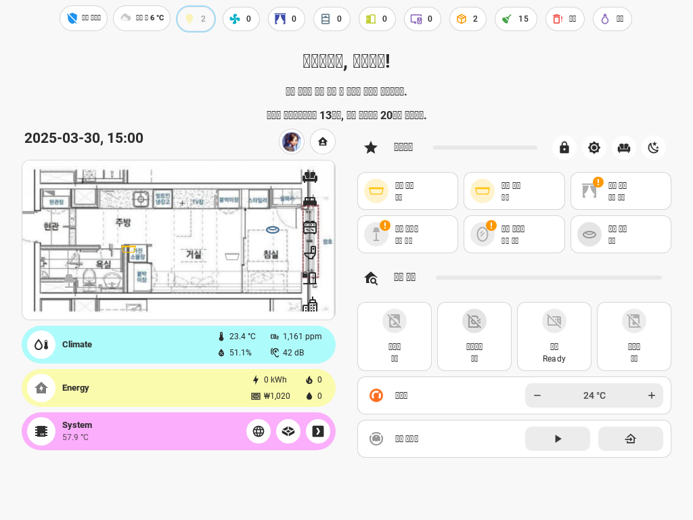

# Dashboards

제 설정의 `ui-lovelace.yaml`는 Readme 커스텀 컴포넌트로 자동으로 만들어졌습니다. `lovelace: mode: storage` 모드를 사용하고 있으므로 yaml에 대해서는 질문해도 잘 모릅니다.

## 개요

- 최대한 사람 손이 덜 가게 템플릿 센서, 그룹, 레이블, jinja2 template 등을 통해 구성 자동화.
- 월패드 사용을 전제로 섹션 너비는 2로 설정. 기존에는 섹션 너비를 3으로 만들었으나 화면 크기에 따른 다양한 변화를 전부 고려하기 힘들어서 2로 줄였습니다.
- 좌측 단축탭은 숨기고 사용하는걸 전제로 최대한 모든 정보를 단일 러브레이스 내에서 해결
- 전반적으로 애플 홈킷의 디자인과 사용자 경험을 모방하였습니다. 제가 아이폰 유저라... 홈킷을 참조하기가 편했습니다.

