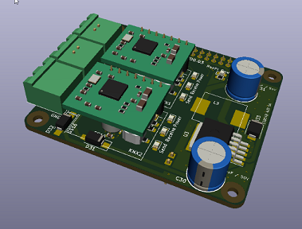

# Hardware

This document provides a comprehensive list of the hardware present in my smart home setup. Some links in this document are affiliate links. If you purchase something through these links, I may receive a small commission at no extra cost to you.

## Table of Contents

- [Home Assistant](#home-assistant)
- [Hubs](#hubs)
- [Climate](#climate)
- [Windows/Curtains](#windowscurtains)
- [Lights](#lights)
- [Wall Switches](#wall-switches)
- [Power Plugs](#power-plugs)
- [Voice Control](#voice-control)
- [Security](#security)
- [Other Sensors](#other-sensors)
- [Media](#media)
- [Other Hardware](#other-hardware)

## Home Assistant

| Device | Quantity | Connection | Home Assistant | Notes |
| :---: | :---: | :---: | :---: | :---: |
| [Raspberry Pi 5](https://www.raspberrypi.com/products/raspberry-pi-5/) | - | - | [Raspberry Pi](https://www.home-assistant.io/installation/raspberrypi/) | Used with HAOS and supports PoE. |
| [OpenKNX RasPi HAT](https://github.com/OpenKNX/OpenKNX/wiki/OpenKNX-RasPi-HAT) | - | - | - | HAT |
| [Xinjian AX650n AI Accelerator](https://item.taobao.com/item.htm?id=831650560883) | - | - | - | HAT |

## Hubs

| Device | Quantity | Connection | Home Assistant | Notes |
| :---: | :---: | :---: | :---: | :---: |
| [AppleTV 4K 3rd](https://www.apple.com/lae/apple-tv-4k/) | 1 | LAN | [Thread](https://www.home-assistant.io/integrations/thread/) | Used as the main Thread Border Router. The SONOFF ZBDongle-E dongle with OTBR addon serves as a backup Thread Border Router. |

## Climate

| Device | Quantity | Connection | Home Assistant | Notes |
| :---: | :---: | :---: | :---: | :---: |
| [LG System Air Conditioner](https://www.lge.co.kr/kr/business/product/cooling/single-multi-v-s-living) | 1 | Wi-Fi | [LG ThinQ](https://www.home-assistant.io/integrations/lg_thinq/) | LG system air conditioner. |

## Windows/Curtains

I have transitioned from blinds to curtains but have not yet purchased a curtain motor.

| Device | Quantity | Connection | Home Assistant | Notes |
| :---: | :---: | :---: | :---: | :---: |
| - | - | - | - | - |

## Lights

| Device | Quantity | Connection | Home Assistant | Notes |
| :---: | :---: | :---: | :---: | :---: |
| [Aqara LED Bulb T2 E26](https://us.aqara.com/products/aqara-led-bulb-t2-e26) | 3 | Thread | [Matter (BETA)](https://www.home-assistant.io/integrations/matter/) | Supports Matter over Thread and offers good light quality. |
| [Aqara LED Bulb T2 GU10](https://us.aqara.com/products/aqara-led-bulb-t2-gu10) | 1 | Thread | [Matter (BETA)](https://www.home-assistant.io/integrations/matter/) | Same as above. |
| [Auxmer LED CCT Strip](https://www.aliexpress.com/item/1005005645881199.html) | 1 | - | - | 38.4W/m (240 LEDs). Highly desirable but four times more expensive than the one below. I use this strip for main lighting. |
| [COXO LED CCT Strip](https://www.aliexpress.com/item/1005005791196110.html) | 1 | - | - | 14W/m (608 LEDs). While Auxmer is better in performance, the price difference is significant. However, it's good for ambient lighting. |

## Wall Switches

| Device | Quantity | Connection | Home Assistant | Notes |
| :---: | :---: | :---: | :---: | :---: |
| [SPEEL TouchNet T2R All-Off + Gas Cut-Off Switch](http://speel.co.kr/project/%ec%9d%bc%ea%b4%84%ec%86%8c%eb%93%b1%ea%b0%80%ec%8a%a4%ec%b0%a8%eb%8b%a8-2/) | 1 | - | [ESPHome](https://www.home-assistant.io/integrations/esphome/) | Features all-off and gas cut-off functions. However, I don't use the all-off function as it cuts off electricity. |
| [Aqara H2 US](https://www.aqara.com/en/product/light-switch-h2-us/) | 1 | Thread | [Matter (BETA)](https://www.home-assistant.io/integrations/matter/) | The only physical switch in my home. Controls the bathroom, shower booth, and exhaust fan. The last button is used as an all-off scene switch. |

## Power Plugs

| Device | Quantity | Connection | Home Assistant | Notes |
| :---: | :---: | :---: | :---: | :---: |
| - | - | - | - | - |

## Voice Control

Previously, I used the GPT-4o model from [OpenAI Conversation](https://www.home-assistant.io/integrations/openai_conversation/), but now I use the Gemini 2.0 Flash model from [Google Generative AI](https://www.home-assistant.io/integrations/google_generative_ai_conversation/) because it's free.

| Device | Quantity | Connection | Home Assistant | Notes |
| :---: | :---: | :---: | :---: | :---: |
| [Home Assistant Voice Preview Edition](https://www.home-assistant.io/voice-pe/) | 2 | Wi-Fi | [ESPHome](https://www.home-assistant.io/integrations/esphome/) | Official hardware from Home Assistant. Functionally similar to ReSpeaker Lite but more aesthetically pleasing. |

## Security

I use the Doods addon for object detection. It can handle over 10 FHD streams, detect motion, and recognize objects.

| Device | Quantity | Connection | Home Assistant | Notes |
| :---: | :---: | :---: | :---: | :---: |
| [Eve Motion](https://www.evehome.com/en/eve-motion) | 1 | Thread | [Matter (BETA)](https://www.home-assistant.io/integrations/matter/) | Works well but is quite expensive. |
| [Aqara Door and Windows Sensor P2](https://www.aqara.com/en/product/door-and-window-sensor-p2/) | 2 | Thread | [Matter (BETA)](https://www.home-assistant.io/integrations/matter/) | Excellent but slightly more expensive than the previous Zigbee model. The battery specification is unique. |

## Other Sensors

| Device | Quantity | Connection | Home Assistant | Notes |
| :---: | :---: | :---: | :---: | :---: |
| [Netatmo Home Coach](https://shop.netatmo.com/en-eu/aircare/home-coach) | 1 | Wi-Fi | [Netatmo](https://www.home-assistant.io/integrations/netatmo/) | Cloud-based. Unfortunately, it doesn't measure air quality in detail. |

## Media

I use Music Assistant and Apple Music for music streaming.

| Device | Quantity | Connection | Home Assistant | Notes |
| :---: | :---: | :---: | :---: | :---: |
| [Apple TV 4K 3rd](https://www.apple.com/lae/apple-tv-4k/) | 1 | LAN | [Apple TV](https://www.home-assistant.io/integrations/apple_tv) | The 3rd version is used as the main media station. |
| [Home Assistant Voice Preview Edition](https://www.home-assistant.io/voice-pe/) | 2 | Wi-Fi | [ESPHome](https://www.home-assistant.io/integrations/esphome/) | Used as a Music Assistant streamer. |
| [Edifier MR5](https://www.edifier.com/int/global/p/studio-monitors/mr5) | 1 | - | [ESPHome](https://www.home-assistant.io/integrations/esphome/) | Connected to the above Voice PE. |
| [JBL Flip 4](https://kr.jbl.com/JBL+Flip+4.html) | 1 | - | [ESPHome](https://www.home-assistant.io/integrations/esphome/) | Connected to the Voice PE. Waterproof, used as a bathroom speaker. |

## Other Hardware

### Network Devices

I use Ubiquiti equipment. They are not exactly enterprise-grade devices, but they do the job in my home lab. Plus, they look nice.

| Device | Quantity | Connection | Home Assistant | Notes |
| :---: | :---: | :---: | :---: | :---: |
| [Unifi Gateway Lite](https://techspecs.ui.com/unifi/cloud-keys-gateways/uxg-lite) | 1 | LAN | [Unifi Network](https://www.home-assistant.io/integrations/unifi/) | Small and does its job. More than enough for a single-person room. |
| [UniFi Switch 8 60W](https://techspecs.ui.com/unifi/wifi/uap-iw-hd) | 1 | LAN | [Unifi Network](https://www.home-assistant.io/integrations/unifi/) | An older generation PoE switch. |
| [UniFi AC lite](https://techspecs.ui.com/unifi/wifi/uap-ac-lite) | 1 | LAN | [Unifi Network](https://www.home-assistant.io/integrations/unifi/) | Also sufficient for a single-person room. |
| [Unifi Gateway Pro](https://techspecs.ui.com/unifi/cloud-keys-gateways/uxg-pro) | 1 | LAN | [Unifi Network](https://www.home-assistant.io/integrations/unifi/) | Purchased for $200 on eBay. This is the router for a NAS located more than 10 km away. Connected via Site-to-Site VPN to the home network. |
| [Cloudkey+](https://techspecs.ui.com/unifi/cloud-keys-gateways/uck-g2-plus) | 1 | LAN | [Unifi Network](https://www.home-assistant.io/integrations/unifi/) | I use Cloudkey because I wanted to keep everything local and have the ability to access other sites remotely. |

### Appliances

| Device | Quantity | Connection | Home Assistant | Notes |
| :---: | :---: | :---: | :---: | :---: |
| [HNF-I2101](https://www.hyundaiht.co.kr/product/smart_home/view.php?returnURL=%2Fproduct%2Fsmart_home%2Flist.php&idx=22) | 1 | Wi-Fi | [ESPHome](https://www.home-assistant.io/integrations/esphome/) | Hyundai Telecom wall pad. |
| [Samsung BESPOKE Microwave 23L (Grill Fry)](https://www.samsung.com/sec/micro-wave-ovens/microwave-oven-grill-MG23T5018CC-d2c/MG23T5018CP/) | 1 | Wi-Fi | [Smartthings](https://www.home-assistant.io/integrations/smartthings/) | Can check the remaining time. |
| [xBloom Studio](https://xbloom.com/pages/xbloom-studio) | 1 | Bluetooth | - | Extremely convenient. |
| [LG CordZero Object Collection R5](https://www.lge.co.kr/vacuum-cleaners/r585wka1) | 1 | Wi-Fi | [LG ThinQ](https://www.home-assistant.io/integrations/lg_thinq/) | LG robot vacuum cleaner. |

### Other Devices

| Device | Quantity | Connection | Home Assistant | Notes |
| :---: | :---: | :---: | :---: | :---: |
| [Oral-B Smart Series 6000] | 1 | Bluetooth | [Oral-B](https://www.home-assistant.io/integrations/oralb/) | Electric toothbrush. Can monitor brushing times. |
